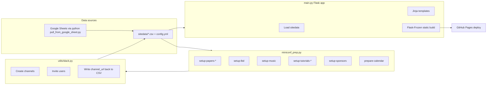

# ISMIR MiniConf Workflow

This document describes how this repository works: building the virtual conference website and automating Slack workspace setup for ISMIR.

## What This Repo Is

This is a **fork/adaptation of [MiniConf](https://github.com/Mini-Conf/Mini-Conf)** for **ISMIR**. Set the conference local timezone in `sitedata/config.yml` via `timezone: <IANA zone>` (for example `Asia/Dubai`). The committed `sitedata/` still holds the ISMIR 2025 sample dataset. It has two jobs:

1. **Build the virtual conference website** — schedule, papers, posters, LBDs, music, industry sponsors, tutorials, etc.
2. **Automate Slack workspace setup** — create channels, invite people, write channel descriptions with links back to the site.

The site and Slack automation both read from the same **`sitedata/`** CSV/YAML files. Those files are the source of truth. See [Part 3: Data](#part-3-data-sitedata) for file formats, what's committed, dummy setup, and sensitivity notes.

---

## Architecture at a Glance



---

## Part 1: The MiniConf Website (`main.py`)

`main.py` is a **Flask app** that loads everything in `sitedata/`:

| File | Purpose |
|------|---------|
| `config.yml` | Conference metadata, feature flags, calendar colors, Auth0 |
| `papers.csv` | Paper metadata, PDFs, videos, posters, Slack links |
| `events.csv` | Schedule (sessions, tutorials, meetups, etc.) |
| `lbds.csv` | Late-breaking demos |
| `music.csv` | Music program |
| `industry.csv` | Sponsor/industry sessions |

It builds pages like posters (`/poster_<uid>.html`), schedule, tutorials, LBDs, music, and industry. Templates (e.g. `poster.html`) show a **Slack button** when `channel_url` is set.

### Run locally

```bash
export FLASK_DEBUG=True FLASK_DEVELOPMENT=True
python main.py
```

### Deploy

`make freeze` generates a static `build/` folder; `make deploy` pushes it to GitHub Pages.

---

## Part 2: Data Prep & Slack Automation (`miniconf_prep.py`)

`miniconf_prep.py` is the **orchestrator** for conference setup. Run it with `--action` (add `--mockup` for `sitedata_mock/`):

| Action | What it does |
|--------|----------------|
| `setup-papers-create-channels` | Creates public Slack channels from `slack_channel` column |
| `setup-papers-invite-authors` | Invites authors (from `author_emails`) into their paper channels |
| `setup-papers-set-desc` | Sets paper channel topic/purpose with paper metadata and the matching poster-session Slack link |
| `set-event-channel-desc` | Sets description for event rows, including `Poster Session - N`, with the event Zoom/live URL and schedule context |
| `setup-lbd` | LBD poster channels (`lp-*` / `lv-*` naming) |
| `setup-music` | Music performance channels |
| `setup-tutorials-create-channels` | Create permanent `#announcements`/`#help` defaults plus public tutorial channels for the temporary-default onboarding window |
| `setup-tutorials-invite-attendees` | Add active/pending invited registrants to their selected tutorial channels |
| `setup-tutorials` | Compatibility action: run both tutorial stages, leaving channels public |
| `setup-sponsors` | Industry/sponsor channels + invite registered emails |
| `prepare-calendar` | Converts schedule CSV → downloadable ICS |
| `remove-author-email` | Strips private contact info before publishing |
| `process-new-users` | Re-runs tutorial + sponsor invites for new registrations |

Requires `SLACK_BOT_TOKEN` in the environment (loaded from `.env` via `utils/slack.py`).

### Paper Slack workflow

Follow [Section "Running it" in SLACK.md](./SLACK.md#running-it)

### Channel naming for papers

Defined in `modules/papers.py` — format `p{session}-{position}-{first-3-words-of-title}`:

```python
def title2channelID(title, session_number, paper_number):
    prefix = f"p{session_number}-{paper_number}"
    # title is cleaned, lowercased, truncated to first 3 hyphen-separated parts
    return f"{prefix}-{formatted_title}"
```

Example: `p2-1-reformulating-soft-dynamic`

### Slack utilities (`utils/slack.py`)

- Creating public/private channels (with rate-limit retries)
- Looking up users by email and inviting them
- Writing `https://slack.com/app_redirect?channel=<id>` back into CSV as `channel_url`
- Setting channel topic and purpose

Without `--prod`, dummy emails are used so you can test without spamming real authors.

Full reference — bot app/scope setup, per-step behavior, idempotence, platform limits, troubleshooting — in [SLACK.md](SLACK.md).

### Session announcements (`long_running_bots/announcement_bot.py`)

A bot that automatically posts an announcement when an event starts. See [../long_running_bots/announcement_bot.py](../long_running_bots/announcement_bot.py) and [../long_running_bots/README.md](../long_running_bots/README.md)  

### Self-service website updates (`long_running_bots/self_service_pusher.py`)

The Slack bot listens for `/push-sheet-to-website` and triggers the GitHub workflow. See [setup and token requirements](../long_running_bots/self_service_pusher.py) and [bot operations](../long_running_bots/README.md).

---

## Part 3: Data (`sitedata/`)

Everything the site and Slack automation need lives under **`sitedata/`**. The Flask app loads all files in that directory at startup; `miniconf_prep.py` reads and writes the same CSVs in place.

### Key columns per file

CSV files. See [./SPREADSHEET_FORMAT.md](./SPREADSHEET_FORMAT.md) for documentation.  
- **`papers.csv`** — one row per accepted paper.
- **`events.csv`** — schedule entries (tutorials, poster sessions, social events, etc.).
- **`lbds.csv`** — late-breaking demos (similar shape to papers, fewer columns).
- **`music.csv`** — music program performances.
- **`industry.csv`** — sponsor / industry sessions.

Additionally,  
- **`config.yml`** — site-wide settings: conference name/dates, feature toggles (`paper_videos`, `lbd_embeds`, …), calendar color map, Auth0 client ID, release-day controls (`paper_day_release`).

### Importing fresh data

`python pull_from_google_sheet.py` pulls CSVs from the master **Google Sheet** (requires env vars `*_SHEET_URL`):

```bash
export INDUSTRY_SHEET_URL="https://docs.google.com/spreadsheets/d/<sheet-id>/edit?gid=<tab-gid>#gid=<tab-gid>"
export PAPERS_SHEET_URL=...
export EVENTS_SHEET_URL=...
export MUSIC_SHEET_URL=...
export LBDS_SHEET_URL=...
export SESSION_ASSIGNMENT_SHEET_URL=...

python pull_from_google_sheet.py

# Then rebuild the calendar:
python scripts/calendar_csv2ics.py
```

Typical loop: **update Google Sheet → `python pull_from_google_sheet.py` → run Slack prep → sanitize → commit `sitedata/` → deploy**.

### Data not in the repo

| Item | Notes |
|------|-------|
| `.env` / `SLACK_BOT_TOKEN` | Gitignored — required for Slack automation |
| Registration CSV | Tutorials/sponsors expect `__23rd_..._Registration_Data.csv` in `sitedata/` — not committed |
| `jobs.csv` | Referenced by `remove_private_details.py` but not present in current `sitedata/` |
| Master Google Sheet | Source of truth during active conference prep; accessed via `python pull_from_google_sheet.py` |

### Dummy / local setup

**Website only** — works out of the box with committed `sitedata/`:

```bash
python3 -m venv .venv
.venv/bin/pip install -r requirements.txt
.venv/bin/python main.py
# → http://127.0.0.1:10000
```

**Slack dry run** — needs your own workspace and token; omit `--prod` to avoid inviting real authors:

```bash
# .env (gitignored)
SLACK_BOT_TOKEN=xoxb-...
DUMMY_EMAIL=you@your-workspace-email.com   # must be a real user in your test workspace

python miniconf_prep.py --action setup-papers-create-channels
python miniconf_prep.py --action setup-papers-invite-authors
python miniconf_prep.py --action setup-papers-set-desc
python miniconf_prep.py --action set-event-channel-desc
```

Notes for dummy Slack runs:

- `author_emails` is empty in committed `papers.csv` — invite step only works with `DUMMY_EMAIL` unless you add emails.
- Existing `channel_url` values target ISMIR 2025; clear them (or use a trimmed CSV) when testing in a new workspace.
- Slack caps channel creation at ~90 per run; 111 papers may need two runs.
- `setup-tutorials-invite-attendees` / `setup-tutorials` / `setup-sponsors`
  need a registration CSV supplied with `--registration-csv`; the legacy 2022
  filename under the selected site data directory remains the fallback.


### Sensitivity and publishing

Before committing or deploying, review what is public vs private.

| File | Private columns | Status in committed data |
|------|-----------------|--------------------------|
| `papers.csv` | `author_emails`, `primary_email` | Empty |
| `events.csv` | `organiser_emails` | Empty |
| `lbds.csv` | `author_emails`, `primary_email` | Empty |
| `industry.csv` | `registered_emails` | Empty |
| `music.csv` | `author_emails`, `primary_email` | 2 emails in bio HTML |

**Peer reviews** — `papers.csv` includes `review1`–`review4` and `meta_review` text for ~76 papers. This is not email PII, but may be confidential internal content depending on conference policy.

**Public by design** — author names, affiliations, abstracts, Google Drive media links, Slack channel URLs.

**Other** — `config.yml` contains an Auth0 client ID (normally treated as public in OAuth). 

**Sanitize before publish:**

```bash
python miniconf_prep.py --action remove-author-email
```

This runs `scripts/remove_private_details.py`, which drops email columns from all CSVs. Also consider stripping review columns and scrubbing music bios if publishing a scrubbed fork.

**Never commit** — `.env`, `SLACK_BOT_TOKEN`, raw registration exports with attendee emails.

---

## Other Directories

| Directory | Purpose |
|-----------|---------|
| `scripts/` | Calendar conversion, thumbnail extraction, registration processing, embedding visualization helpers |
| `templates/` + `static/` | MiniConf UI (schedule calendar, paper browser, poster viewer with embedded PDFs/videos) |
| `modules/` | Per-content-type setup logic (papers, LBDs, music, tutorials, industry, zoom) |

---

## End-to-End Workflow for ISMIR

1. **Collect data** in Google Sheets (papers, schedule, LBDs, music, sponsors).
2. **Pull data** with `python pull_from_google_sheet.py` into `sitedata/`.
3. **Run Slack setup** via `miniconf_prep.py` (papers first, then LBDs/music/tutorials/sponsors as needed).
4. **Sanitize** with `remove-author-email` before publishing if emails shouldn't be on the live site.
5. **Build calendar** with `prepare-calendar`.
6. **Preview** locally with `main.py`.
7. **Deploy** with `make deploy` (static site to GitHub Pages).

Each paper/poster page gets a Slack link; each Slack channel gets a link back to the MiniConf page — that's the core virtual-conference loop.

---

## Things to Be Aware Of

- Branding, URLs, and calendar/Zoom timezone are now driven by `sitedata/config.yml` (`timezone: <IANA zone>`); the committed `sitedata/` CSVs are still the 2025 sample dataset (2025 dates, 2025 Slack links). `sitedata/main_calendar.json` was generated with the old Seoul timezone — regenerating it from the 2025 events.csv would shift those times.
- Some older modules (`tutorials.py`, `music.py`, `industry.py`) call Slack helpers with an older API signature (`slackUtils.client` as first arg), while `papers.py` uses the current `utils/slack.py` API. The papers workflow is the most up to date.
- `setup-zoom` is fully wired: one meeting per live session, `join_url` written back to `events.csv`, breakout room per poster for `Poster Session - N` events. Needs Zoom Server-to-Server OAuth creds in `.env`. See [ZOOM.md](ZOOM.md).
- Slack limits channel creation to ~90 per run; large batches may need multiple runs.
